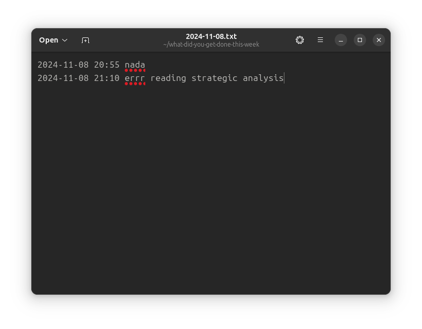

# What did you get done this week?

<p align="center">
  
</p>
<p align="center">
  
</p>

## Features
- Pops up every 15 minutes to ask you what you got done. 
- Writes to a .txt in your home directory.
- Sometimes responds rudely.

## Development

Built with [SvelteKit and Tauri](https://v2.tauri.app/start/frontend/sveltekit/).

Dev server:
```
npm run tauri dev
```
Build for your platform:
```
npm run tauri build
```

Contributions are very welcome. I have no idea what I'm doing here.

## TODO
- [ ] [Releases for Linux, Mac, Windows using GitHub Actions](https://github.com/mbanerjeepalmer/what-did-you-get-done-this-week/issues/1)
- [ ] onCloseRequested handler not correctly intercepting on Ubuntu
- [ ] Skip mechanism (i.e. I didn't achieve anything in the last 15 minutes)
- [ ] Releases for all platforms
- [ ] Fix icon display
- [ ] Fix system tray menu
- [ ] Customisable frequency (i.e. 15mins, one week)
- [ ] Customisable names
- [ ] Ask what _will_ you get done in the next period
- [ ] Notifications instead of

## FAQ
- Q: Are you an Elon fanboy?
    - A: No. I just thought this was funny.
- Q: So, why?
    - A: It's actually pretty handy. And a way for me to try Tauri.
- Q: How do I invest?
    - A: Send doge `DEHUbBqyC7y8Tx1p3jh9JvcPdBtxEfBfTP`
- Q: How do I improve my media diet?
    - A: Funny you should ask. Try [Banquet](https://bnqt.app).